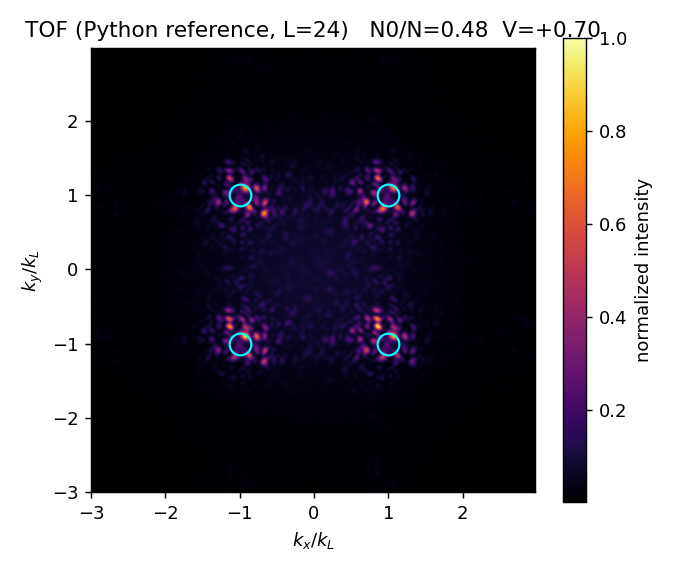

# Time-dependent Gutzwiller on the GPU — square & triangular lattice solver

A modern C++/CUDA revival of the time-dependent Gutzwiller (TDGW) mean-field
dynamics of the Bose–Hubbard model. Personal research project. Sized for a
6 GB RTX 2060 (Turing, sm_75).

Physics follows two papers by Á. Rapp:

- **square lattice / negative-T** (the current target) — Phys. Rev. A **87**, 043611 (2013) [arXiv:1211.4350]
- **triangular / kinetic frustration** (now implemented, `--lattice triangular`) — Phys. Rev. A **90**, 053607 (2014)

This is a **kernel-architecture sketch with a validation scaffold baked in**, not
a finished code. The physics is checked against a tight-tolerance Python reference
and an analytic limit before any GPU result is trusted (see *Validation*).

## The model

Per site `j`, the Fock amplitudes `f_m(j,t)` (truncated at `m = 0..D-1`) obey

```
i d/dt f_m(j) = eps_m(j) f_m(j)  -  J conj(Phi_j) sqrt(m+1) f_{m+1}(j)  -  J Phi_j sqrt(m) f_{m-1}(j)
eps_m(j)      = (U/2) m(m-1) + (V0 r_j^2 - mu0) m
Phi_j         = sum_{k in nbr(j)} <b_k>,    <b_j> = sum_m sqrt(m+1) conj(f_m) f_{m+1}
```

with the per-site normalization `sum_m |f_m(j)|^2 = 1` held for all t. The RHS is a
local tridiagonal-in-`m` operator plus a nearest-neighbour gather for `Phi`.

## Files

```
src/tdgw.cu                     GPU solver (kernels + integrator + diagnostics + selftest)
reference/tdgw_reference.py     trusted CPU oracle (NumPy/SciPy, small lattices)
reference/ground_state.py       self-consistent GA ground state (compressed Mott + seed)
reference/fieldio.py            shared binary field format (Python <-> CUDA --load/--dump)
tests/host_split_step_check.cpp host-only conservation/order check (g++, no CUDA)
tests/stiff_regime_check.cpp    host-only split-step vs RK4 in the stiff U/J regime (g++)
tests/split_step_prototype.cpp  host-only split-step numerics (predictor-corrector)
analysis/tof.py                 time-of-flight image generator (numpy.fft, post-processing)
analysis/make_gif.py            assemble a TOF-vs-time GIF from --dump-every frames
analysis/plot_diag.py           plot N0/N(t), K(t), R(t) from a captured tdgw run log
CMakeLists.txt                  modern CMake; targets sm_75
```

## Architecture decisions

**Memory layout — component-planar SoA, `f[m*N + j]`.** One thread owns one site
and loops over `m`. For fixed `m`, adjacent sites are adjacent in memory, so a warp
issues fully coalesced loads/stores. (`f[j*D + m]` would be uncoalesced across the
warp — the wrong choice on GPU.)

**Lattice = neighbour list** (`nbr[d*N+j]`, `Jdir[d]`). Square (z=4), triangular
(z=6), cubic (z=6) differ *only* in the `make_*()` builder. The kernels and the
integrator never change — that is the entire square → triangular → 3D path.

**RHS = three kernels:** `k_psi` reduces each site's Fock vector to `psi_j = <b_j>`;
`k_phi` gathers neighbour `psi` into `Phi_j` (the only non-local step — a stencil);
`k_rhs` applies the local tridiagonal update.

## Integrator — the one decision that took two tries

Narrated honestly, because it is the crux and the conclusion reversed once.

A Strang split-step that freezes `Phi` during the hop sub-step is **not**
number-conserving (the mean-field hop generator `-(Phi b† + Phi* b)` changes
particle number on a site when `Phi` is frozen). On a **non-stiff toy** (U/J = 0.5)
this made RK4 on the full coupled RHS look strictly better:

| scheme (U/J = 0.5, T = 2) | `|ΔN_tot|` | `|ΔE_tot|` | per-site `|‖f‖²−1|` |
|---|---|---|---|
| Strang split-step (freeze Φ) | ~0.2–0.9 (O(dt)) | ~1–3 | ~5e-6 |
| classic RK4, full RHS | ~1e-7 | ~1e-5 | ~1e-6 |

**But the physical regime is stiff:** `J/U ≈ 0.0023`, i.e. `U/J ≈ 435`. The on-site
phase is then the fast timescale, which flips the conclusion. Comparing both at a
*fixed* dt against a well-resolved fine-dt reference:

| U/J | on-site phase / step | split-step err | RK4 err |
|---|---|---|---|
| 2   | 0.02 rad | 4e-4 | 1e-4 |
| 50  | 0.60 rad | 3e-4 | 5e-3 (N drift 3e-3) |
| 200 | 2.40 rad | 3e-4 | **NaN — unstable** |

In the real regime plain RK4 must resolve the fast U-phase and blows up at any
practical dt, while the **exact-diagonal split-step treats that phase exactly**.

**Conclusion.** Production integrator = exact-diagonal Strang split-step with a
**midpoint-Φ predictor-corrector** + per-site renormalize. The predictor (recompute Φ at
the step midpoint) is the key move: it drops the frozen-Φ `N_tot` leak from O(dt) (~7% at
dt=1e-2) to ~1e-5, so the tiny-dt crutch of the 2013 code (δt = 0.1 ns) isn't needed. RK4
is kept as a non-stiff cross-check — the two must agree there, which is itself a test.
Choose with `--integrator splitstep|rk4` (split-step is the default); split-step uses only
`f`, `ftmp`, `psi`, `phi` vs RK4's 6 buffers, so it also fits 6 GB better.

*Implemented and GPU-validated* (RTX 2060 / CUDA 13.3, `--selftest`): split-step
host-vs-device max|Δf| ≈ 2e-5, N drift ≈ 2e-4; RK4 ≈ 8e-8 / 3e-7; the two agree to ≈ 2e-5
in the non-stiff limit. On the full 192² lattice at U/J = 200, split-step ran 2000 steps
stably with N_tot conserved to ~0.03%, while RK4 diverged to NaN by step 200.

## Memory budget on a 6 GB RTX 2060 (single precision, `cplx = complex<float>`)

State buffer = `N · D · 8 bytes`. RK4 holds 6 full buffers; split-step needs only
`f` and `ftmp` (plus `psi`, `phi`), so the RK4 figures below are the upper bound.

| lattice | N | per buffer (D=12) | RK4 (6 buffers) | split-step (~2–3) |
|---|---|---|---|---|
| 192² (square) | 3.7e4 | 3.5 MB | 21 MB | — (irrelevant) |
| 192³ (cubic)  | 7.1e6 | 679 MB | ~4.1 GB (tight w/ display) | ~1.4 GB |

The square phase has **zero** memory pressure. For full 192³, keep `D` to the
smallest converged value (8–12) and use split-step. Double precision is off the
table for 192³ here (state alone ≈ 1.4 GB × buffers, and consumer Turing runs FP64
at 1/32 rate). Runtime is bandwidth-bound; on the 2060 (~330 GB/s) expect very
roughly 30–50 ms/step for 192³ single precision — ~10⁴ steps in minutes, ~10⁶
overnight.

## Validation ladder (checked vs. next)

1. **Conservation** — per-site norm, `N_tot`, `E_tot`. *Checked:* Python reference
   holds all three to ~1e-8.
2. **U = 0 analytic limit** — coherent states stay coherent; `<b>(t)` must equal the
   exact free tight-binding `expm(-i H_sp t) psi0`. *Checked:* ~5e-7 relative.
3. **Host vs device** — `--selftest` runs both integrators on CPU and GPU and diffs them
   (isolates parallelisation bugs). *Checked* on RTX 2060 / CUDA 13.3: RK4 max|Δf| ≈ 8e-8;
   split-step ≈ 2e-5; the two agree to ≈ 2e-5 in the non-stiff limit.
4. **Reference vs SciPy** — the Python file integrates the same RHS with adaptive
   RK45 at tight tolerance; diff the CUDA output against it on a small lattice.
5. **Physics acceptance** — see below.

## Reproduction target (square lattice, Rapp 2013)

The milestone that says the project is alive again: run **protocol (a)** (final
`U_f < 0`, `V0_f < 0`) and recover the negative-T signature —

- `C(t) < 0` (nearest-neighbour **anticoherence**), `<b_j> ≈ (−1)^j <b_0>` alternating
  across sublattices, kinetic energy `K = −J·C > 0` (inverse population);
- **four time-of-flight peaks at the Brillouin-zone corners** `Q = (±k_L, ±k_L)`.

Spec: 80²–160² sites; `D = 7` (max occupation `m_c = 6`); `N_tot ≈ 1920`; initial
state a compressed Mott insulator (n=1 core + thin superfluid shell) from a
self-consistent Gutzwiller solve, `J/U ≈ 0.0023`, `mu0/U ≈ 0.15` at t₀ = 20 ms. A perfect
deep-Mott state has ⟨b_j⟩ = 0 — a dynamical fixed point — so a small seed (the thin SF
shell) is needed to nucleate post-quench coherence (verified in `reference/ground_state.py`:
unseeded stays frozen, seeded develops N₀). It must also be **low-entropy**: the conserved
energy E_f = ⟨ψ_init|H_f|ψ_init⟩ must sit near the top of the bounded-above reversed spectrum
for a condensate to form (effective T<0, *cold*). The compressed Mott's low kinetic energy
ensures this; the seed must stay small so it doesn't heat the final state (verified: small
seed → macroscopic (π,π) condensate; large seed → incoherent). Protocol-(a) values that give
the signature (J_f=1 units): U_f ≈ −2.2 (paper's U/J(30.5 ms)≈−2.19), V0_f ≈ −8e-4.
Observables: `N_tot`, cloud radius `R(t)`, condensate `N_0(t) = Σ|<b_j>|²`, coherence
`C(t) = Σ_<ij> <b_i>*<b_j>`, and `I_TOF(k) ∝ |w(k)|² (N_tot − N_0 + |b(k)|²)`,
`b(k) = Σ e^{−ik·r_j} <b_j>`.

## Results

Protocol (a) reproduced end-to-end on the RTX 2060 (L=192, D=7, N ~ 1900): from the
compressed-Mott + SF-shell initial state, quenched to `U_f/J = -2.2`, `V0_f/J = -8e-4`,
the cloud develops the negative-T signature —

- condensate fraction **N0/N ~ 0.62** (stable to the end of the run),
- bond/kinetic energy **K > 0** (K/N ~ +1.7 J) — the inverse population,
- TOF **visibility V > 0** — weight piled on the BZ corners,
- **four TOF peaks at Q = (+-k_L, +-k_L)**,
- N_tot conserved to ~0.02%, per-site norm ~1e-7, cloud radius R ~ 38 << L/2 (no wall contact).



The figure is the trusted Python reference at small L; the L=192 GPU run gives the same
four-corner pattern, sharper. Reproduce with the *Physical run* commands above; build the
time-lapse with `analysis/make_gif.py` and the diagnostics plot with `analysis/plot_diag.py`.

Caveat: this is the pure Gutzwiller mean-field result — no quantum/thermal fluctuations — so
it **over-orders** vs experiment (sharper peaks, higher N0/N). Beyond-GA (e.g. truncated
Wigner) would broaden it; out of scope here.

## Requirements

Verified toolchain (Windows): CUDA Toolkit **13.3**, Visual Studio **2022** with the
"Desktop development with C++" workload (MSVC 19.4x, which also bundles CMake **3.31**),
and an NVIDIA RTX 2060 (Turing, sm_75) with a current driver. Python side: 3.10+ with
`numpy` and `scipy` (a virtualenv is enough).

CUDA 13.x + MSVC note: Thrust/CCCL requires MSVC's standard-conforming preprocessor;
`CMakeLists.txt` already forwards `/Zc:preprocessor`, so no manual step is needed.

## Build & run

Windows (from a VS "x64 Native Tools" / Developer prompt, or any shell with `cmake`
and `nvcc` on PATH):

```
cmake -B build
cmake --build build --config Release

.\build\Release\tdgw.exe --selftest                 # GPU: host-vs-device + conservation
.\build\Release\tdgw.exe --L 192 --D 12 --steps 20000 --dt 0.002
.\build\Release\host_check.exe                      # CPU-only integrator check
```

Python reference (inside a venv): `python reference\tdgw_reference.py`.

Physical run — compressed-Mott initial state → quench → TOF (`U_f<0, V0_f<0` = protocol a):

```
python reference\ground_state.py --L 128 --V0 2.4e-4 --dump init.bin --no-check   # Mott core + SF shell
.\build\Release\tdgw.exe --load init.bin --U -2.2 --V0 -8e-4 --steps 20000 --dt 0.002 --dump final.bin
python analysis\tof.py --in final.bin --out results\tof.png            # four-peak TOF
```

Time series → GIF (watch N0/N, K, R evolve and the peaks form):

```
mkdir results
.\build\Release\tdgw.exe --load init.bin --U -2.2 --V0 -8e-4 --steps 20000 --dt 0.002 --dump-every 500 --dump-prefix results\frame
python analysis\make_gif.py "results\frame_*.bin" --out results\tof.gif --fps 10
```

Triangular lattice — kinetic frustration (Rapp 2013/14). Same binary; add `--lattice
triangular` (z=6, hoppings `--J1 --J2 --J3`; isotropic default 1:1:1). `ground_state.py`
and `tof.py` take the same flag:

```
python reference\ground_state.py --lattice triangular --L 128 --V0 2.4e-4 --dump init_tri.bin --no-check
.\build\Release\tdgw.exe --lattice triangular --J1 1 --J2 1 --J3 1 --load init_tri.bin --U -2.2 --V0 -8e-4 --steps 20000 --dt 0.002 --dump final_tri.bin
python analysis\tof.py --lattice triangular --J1 1 --J2 1 --J3 1 --in final_tri.bin --out results\tof_tri.png
```

The negative-T condensate forms at the single-particle band **maxima** (the K-points),
which for the isotropic lattice are the six corners of the hexagonal BZ at |k|≈1.33 k_L
— the 120° three-sublattice order. `tof.py` locates those maxima from the dispersion
(`band_max_k`) and reports a K-point coherence `C_K`; because the maxima **move** with
the anisotropy J1:J2:J3, sweeping J2 down from 1 toward the rhombic limit is the
frustration study (`eps_max` climbs 3.0 → 4.0). Reference figure: `docs/tof_triangular_reference.png`.

Linux/macOS: `cmake --build build -j`, then `./build/tdgw --selftest`; the host-only
tests build directly with `g++ -O2 -std=c++17 tests/<file>.cpp`.

Debugging/profiling: `compute-sanitizer` for races/OOB, `ncu` / `nsys` (Nsight) for
kernel and timeline profiling.

## Roadmap

1. ~~Exact-diagonal split-step integrator~~ — **done** (`--integrator splitstep`, default; midpoint-Φ predictor-corrector).
2. ~~Compressed-Mott initial state + field I/O~~ — **done**: `reference/ground_state.py`
   builds it (verified stationary, with the SF shell); `fieldio.py` + `tdgw --load`/`--dump